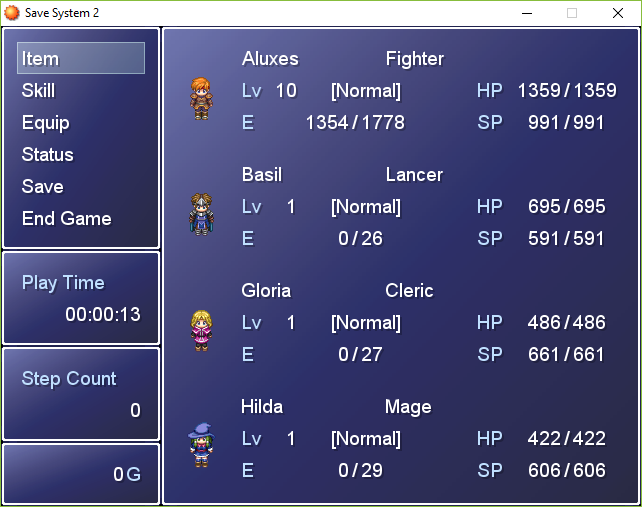
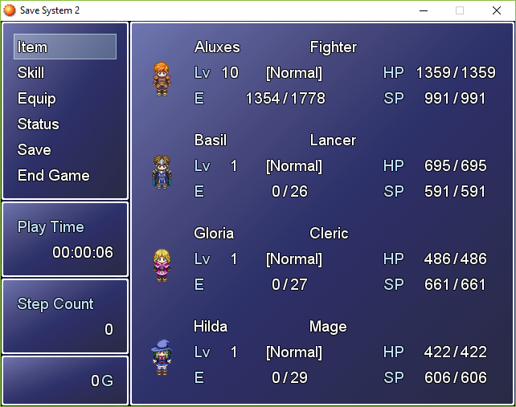
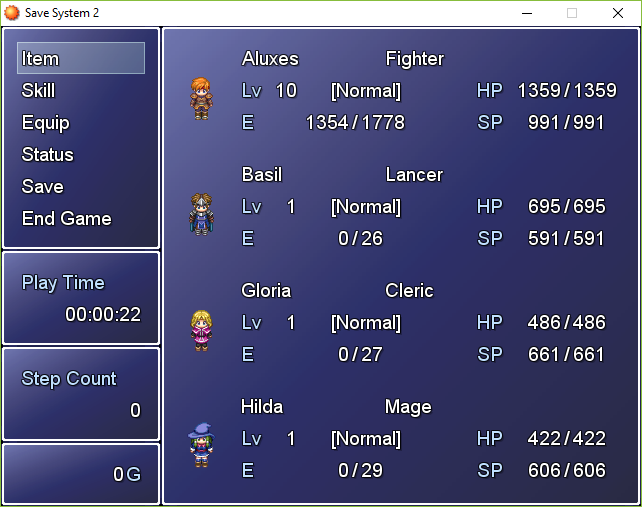

# Font Effects

This script adds two font properties to RPG Maker XP: text **shadow** and **outline**.


## How to use

Add the script anywhere before the `Main` script.

To use these properties in a specific window, use the following lines:
```rb
self.contents.font.shadow = true
self.contents.font.outline = true
```

If you want to set these properties to be used by default, through all the project, use these lines:
```rb
Font.default_shadow = true
Font.default_outline = true
```

Colors for shadow and outline can be changed using `.shadow_color` and `.out_color`.

Alternatively, `Font.default_shadow_color` and `Font.default_out_color` can be used to make a global change.


## Screenshots

Text with shadow




Text with outline



Text with shadow and outline


